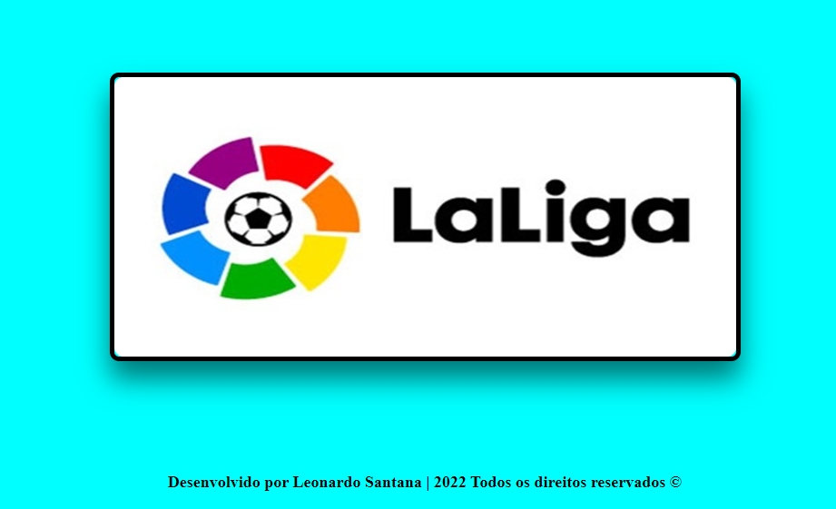
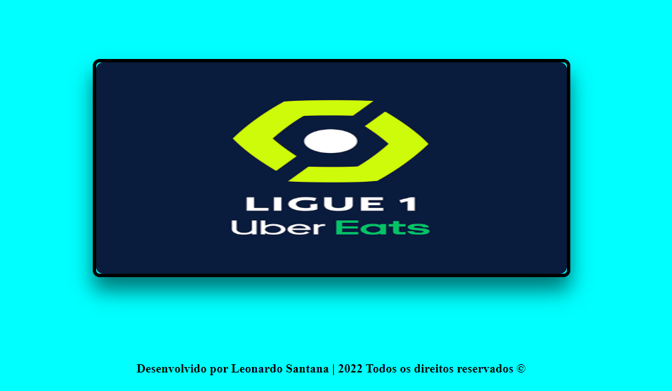
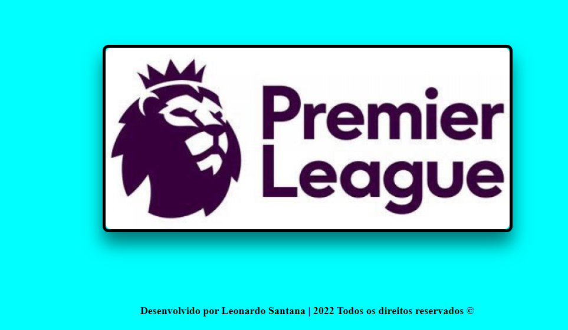
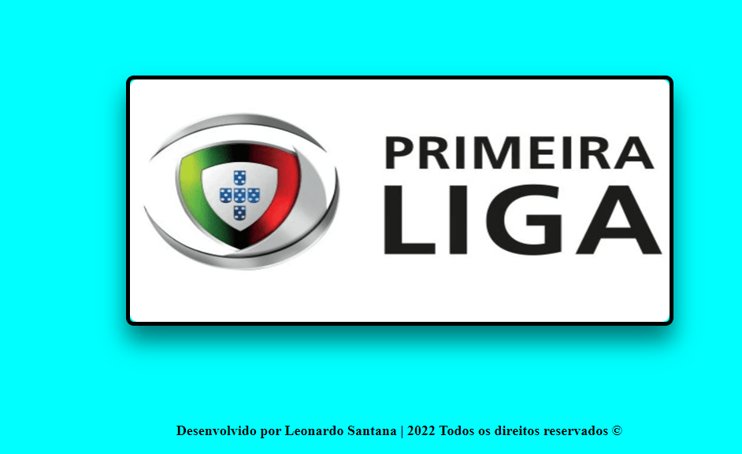
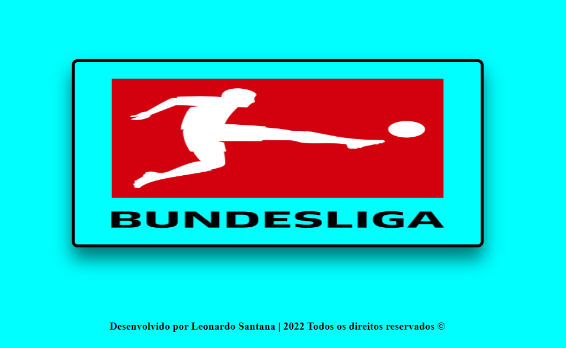

# Sobre o projeto:

Projeto de um Slideshow desenvolvido em HTML5, CSS3 e JavaScript, onde o objetivo é mostrar os slides das imagens quando o usuário clica para passar para o próximo slide. No projeto, na parte do CSS, foi aprendido a usar variáveis para usar no slide, foi aprendido também usar o Flexbox para posicionar os elementos. No JavaScript, o uso de funções anõnimas foi usado para pegar as imagens do slideshow, junto com a DOM. O evento de click foi usado, para que o usuário consiga passar as imagens no slide. 

# Tecnologias utilizadas:

- HTML5,
- CSS3 e 
- JavaScript;

# Layout do projeto:

## Imagem 1:

## Imagem 2:

## Imagem 3:

## Imagem 4:

## Imagem 5:

## Imagem 6:

# Link do projeto:

https://lsantana95.github.io/Slideshow/ 

# Autor:

Onde me encontrar?

- Entrar em contato comigo:

https://lsantana95.github.io/RocketLinks/
